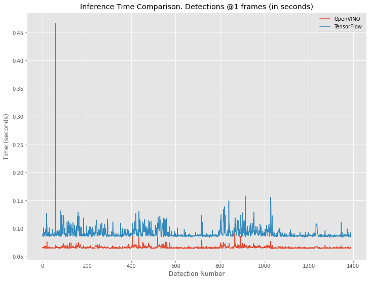
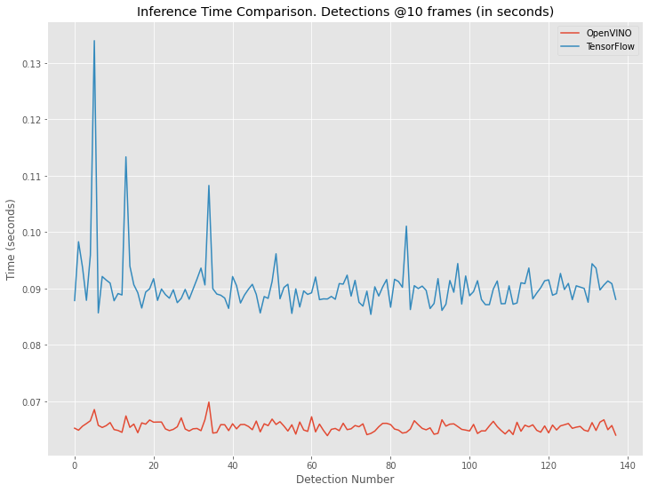
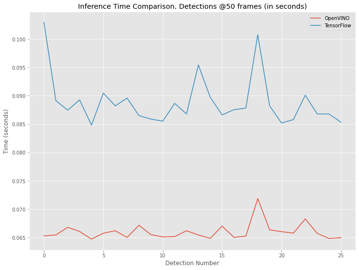

# Project Write-Up

This project was made as one of the requirements in order to obtain Intel(R) Edge AI for IoT Developers Nanodegree program at Udacity. In this Write Up, I will explain some concepts related with OpenVINO usage and some considerations from the user side.

## Explaining Custom Layers

When loading a model inside an OpenVINO application, chances are that the model requires some operations not supoorted by default OpenVINO library (operations like especial activation functions, loss functions, etc). This could create situations where is not possible for the Model Optimizer to create an appropriate direct Intermediate Representation.

In that case, OpenVINO offers different options depending on model original framework (TensorFlow, Caffe, MXNet, etc), available devices and user preferences to handle those not recognized operations as Custom Layers.

At the moment the Model Optimizer tries to convert a model, it will give more relevance to preserve any defined Custom Layer, which means that if a layer is defined as custom (with some internal logic), it will be used even if such layer is already supported. 
The simplified workflow is as follows:
  1. When a model operation is loaded, will check first if it is defined as a Custom Layer, depending of the framework, this could be either the operation is already described in a Custom Layers file, or as an extension for the Model Optimizer. If not, then it will check if the operation could be described using default configurations already available with OpenVINO.

  2. There are cases when operation's complexity (or user preferences) makes it not possible to create a representation that is suitable for the Inference Engine. In those scenarios, we can redirect the computation effort to the model original framework. This has some disadvantages, like that the device where the model will run must have the framework installed and, for sure, it will not be as efficient as if the model was completely represented as a full OpenVINO Intermediate Representation.

The result of the Model Optimizer conversion of a model with (or without) Custom Layers should be Intermediate Representation files (.xml and .bin). But for the application, in order to be able to run, the Inference Engine needs also to be fed with relevant extensions regarding model required operations, including custom ones. These extensions are device-related, and it is also possible to have an application running on multiple different devices, each one handling different extensions.

## Comparing Model Performance

For model comparison, I choose different approachs for each of the following metrics, as they need to be evaluated on their own:

* Chosen Model: TensorFlow SSDLite MobileNet v2 (refer to [app-explained](app-explained.md) for more details)

### Accuracy:

As far as with my app is related, both TensorFlow model and converted OpenVINO one perform exactly the same. This is mostly because the logic I used inside the app tries to be "tolerant" with misdetections.

### Model Size:

| Model           | Size (MB)          |
|:-----------------------:|:---------------:|
| TensorFlow |  20.7 |
| IR OpenVINO |  17.9 |

This means OpenVINO model is around 13.5% smaller, a great improvement considering usual memory restrictions in IoT devices.

### Inference Time:

**Processor Characteristics**: Intel® Core i5-3230M @2.6 GHz Ivy Bridge (3rd Generation)

I created a small script to measure each model average inference time at different frecuencies:

**Note:** As TensorFlow took too much time to make first inference, I decided to only take into account starting from the second one, this to avoid any comparison error related with models internal configurations.

| Frequency   | TensorFlow Avg Time (secs) | OpenVINO Avg Time (secs)|
|:-----------------------:|:---------------:|:---------------:|
| 1 (each frame) |  0.09248 | 0.06641 |
| 10 |  0.09043 | 0.06546 |
| 50 |  0.08885 | 0.06604 |

This account for around 27% improvement in inference time for the OpenVINO model over pure TensorFlow.

In the following graphs we can see that this behaviour was maintained during all video analysis:

<p align="center">

</p>

<p align="center">

</p>

<p align="center">

</p>


## Assess Model Use Cases

People counter app has many potential uses, some of them are:

  * To guarantee a place is not overcrowded, or there are some limitations related with the quantity of people allowed to be there. Like in these days with COVID19 issues, places like grocery stores and bank would need to avoid people concentrations in closed spaces.
  
  * For Urban Planning, like checking the number of people that uses determined streets, will help Urban Planners create projects in order to improve city life quality. It is also possible to modify the people counter app to count vehicles (with minor changes), giving them more valuable information of the city dynamics.
  * Retail stores could create people traffic heat-maps to check where people prefer to be in the store, providing useful information for targeted marketing, products positioning and even how many people visited the store.
  * In emergency scenarios, it will be useful to know how many people is inside a place (building, factory, etc) as an indicator for possible rescue operations.
  * For security reasons, it could be an indicator of some problems happening if someone spends too much time in a given place, from factories (hazardous zones) to banks (time spent in ATMs).

These or any other applications should also consider that the app is not perfect, which means some conclusions should not be taken expecting this. For example, a person could enter with a blanket covering him and the app (as it is presented here) will not make a detection. It is possible to include other elements to avoid this situations, but as for today, there are not perfect people detection models.


## Assess Effects on End User Needs

As with any computer vision application, and this is not by any means an issue only with OpenVINO, they are very affected by conditions present during image capturing.

When we develop a computer vision application, we must consider as many different scenarios as possible, small things like lighting (for example, if the camera is placed outdoors, we must evaluate poor lighting conditions during nights) can dramatically diminish application performance. Handling bad quality images should also be taken into account, but for most cases also high quality images are not available or neither are convenient. This point is very model dependent, as most of them are trained under very specific situations. The main idea is to feed them with the minimum conditions necessary for acceptable accuracy.

Also, as stated in the previous section, model accuracy should be taken with caution, it is necessary to create some inside application logic in order to reduce as much as possible any model error, and some times it is not only related with model complexity. For example, for my application I tested an SSD Inception model and SSDLite one, the former was almost 5 times bigger than the later, but they failed in the same situations (a person standing very still), that is why, for other performance considerations, I chose SSDLite and included some application logic to cope with those misdetections.

Other important considerations imply the nature of IoT devices, which need to work in very constrained environments, as opposed to applications running on a laptop or in the cloud. One of the most relevant ones is network usage.

Any network use means that the device should use some of it resources for sending information, resources like processing capabilities (even if they are small) and power consumption, maybe the most constrained resources any IoT device has. Regarding this, the application logic should be designed to only send relevant information through the network, especially for computer vision applications where it could be necessary to send images.

On the other hand, IoT devices can leverage valuable information where cloud services could be too expensive to use, not preferred due to security reasons or not even available. For example, regarding pricing, as for today, Google Cloud Vision API has a minimum price for object detection of 1.5$ per 1000 images, to put in context, this project video example has around 1300 frames in total and it is only 2 minutes and 20 seconds long, which means that in the conditions I developed it (detection on each frame), running 10 times the video, for a relative 23.5 minutes video duration, will cost around 19.5$, and for sure inference time will not be as fast as with the IoT device.

However, this doesn’t mean that cloud computing is always worse, we need to consider the problem we need to solve and, having all this options available, take the one (or maybe both) that suits better our conditions. 


## Model Research

Making this app work properly posed some challenges, not only because the logic should be flexible enough for those scenarios when any model fails detecting a person, but also for my hardware specifications.

Although the three models presented here work correctly for the required task, I will share some thougts regarding their study. For more information about app logic using them, please refer to [app-explained](app-explained.md).

Models were downloaded and uncompressed following instructions in [README](README.md). Resulting folders were stored in the [tfmodels](./tfmodels) folder.

* Model 1: SSDLite MobileNet v2:
  * Model Source: [SSDLite MobileNet v2](http://download.tensorflow.org/models/object_detection/ssdlite_mobilenet_v2_coco_2018_05_09.tar.gz)

  * Conversion Arguments:
  ```
  <INSTALLATION_PATH>/deployment_tools/model_optimizer/mo_tf.py --input_model=tfmodels/ssdlite_mobilenet_v2_coco_2018_05_09/frozen_inference_graph.pb --tensorflow_use_custom_operations_config <INSTALLATION_PATH>/deployment_tools/model_optimizer/extensions/front/tf/ssd_v2_support.json --tensorflow_object_detection_api_pipeline_config tfmodels/ssdlite_mobilenet_v2_coco_2018_05_09/pipeline.config --reverse_input_channels
  ```

  * This model had the advantage of size and fast inference time, but its accuracy was not enough, even changing probability threshold to values as low as 0.3.

  * I decided to create a logic that considers this issue, please refer to [app-explained](app-explained.md) for more details.

* Model 2: SSD Inception v2:
  * Model Source: [SSD Inception v2](http://download.tensorflow.org/models/object_detection/ssd_inception_v2_coco_2018_01_28.tar.gz)

  * Conversion Arguments:
  ```
  <INSTALLATION_PATH>/deployment_tools/model_optimizer/mo_tf.py --input_model=tfmodels/ssd_inception_v2_coco_2018_01_28/frozen_inference_graph.pb --transformations_config /<INSTALLATION_PATH>/deployment_tools/model_optimizer/extensions/front/tf/ssd_v2_support.json --tensorflow_object_detection_api_pipeline_config tfmodels/ssd_inception_v2_coco_2018_01_28/pipeline.config --reverse_input_channels
  ```

  * In this case, not only the model had as many misdetections as the previous one, but it also had a much higher inference time.

  * Because it is a SSD model, I could use the same logic to improve it as refered in the previous one.

* Model 3: Faster RCNN Inception v2:
  * Model Source: [Faster RCNN Inception v2](http://download.tensorflow.org/models/object_detection/faster_rcnn_inception_v2_coco_2018_01_28.tar.gz)

  * Conversion Arguments:
  ```
  <INSTALLATION_PATH>/deployment_tools/model_optimizer/mo_tf.py --input_model=tfmodels/faster_rcnn_inception_v2_coco_2018_01_28/frozen_inference_graph.pb --transformations_config <INSTALLATION_PATH>/deployment_tools/model_optimizer/extensions/front/tf/faster_rcnn_support.json --tensorflow_object_detection_api_pipeline_config tfmodels/faster_rcnn_inception_v2_coco_2018_01_28/pipeline.config --reverse_input_channels
  ```

  * In this case, the model had much better accuracy, but was much worse on inference time, in my case, making it useless.

  * Wanting to create this app as flexible as possible, I changed some functions and added some logic in order to be able to accept Faster RCNN and SSD models. But for Faster RCNN models in order to be considered as that, model .xml file passed as argument must has the word 'faster' in it.

**Note:** Usually, <INSTALLATION_PATH> is:

```
/opt/intel/openvino
```